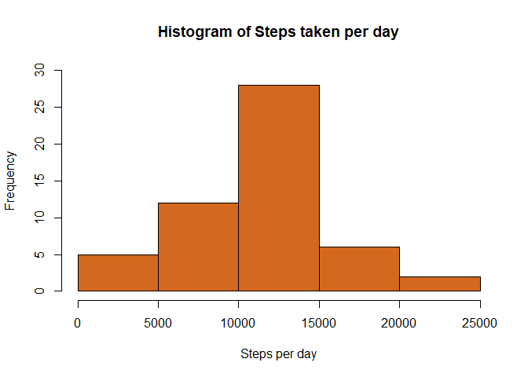
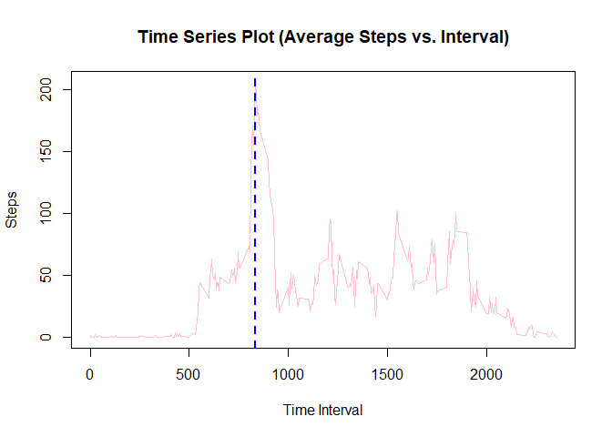
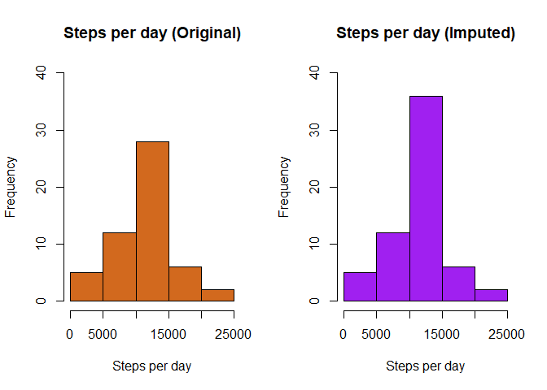
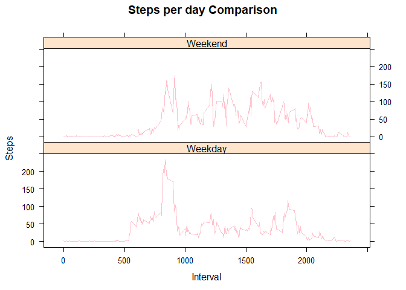

## Data Set

The data set for this assignment consists of steps measured by a personal activity 
monitoring device. This device collects data at 5 minute intervals throughout the dy The data consists of two months of data from an anonymous individual collected during the months of October and November, 2012 and include the number of steps taken in 5 minute intervals each day.

This data is stored in a single CSV file called 'Activity.csv' in the 'activity' directory under the current working directory. 


## Loading and preprocessing the data


Read the CSV file into a data frame. 


```r
# Read the CSV file into a data frame.
data_file <- file.path("activity", "Activity.csv")
my_data <- read.csv(data_file)
```

Examine the data to find its dimensions and content. 


```r
dim(my_data)
```

```
## [1] 17568     3
```

```r
head(my_data)
```

```
##   steps       date interval
## 1    NA 2012-10-01        0
## 2    NA 2012-10-01        5
## 3    NA 2012-10-01       10
## 4    NA 2012-10-01       15
## 5    NA 2012-10-01       20
## 6    NA 2012-10-01       25
```

```r
tail(my_data)
```

```
##       steps       date interval
## 17563    NA 2012-11-30     2330
## 17564    NA 2012-11-30     2335
## 17565    NA 2012-11-30     2340
## 17566    NA 2012-11-30     2345
## 17567    NA 2012-11-30     2350
## 17568    NA 2012-11-30     2355
```

## What is mean total number of steps taken per day?

Create an aggregate data frame of the total number of steps taken each day and examine the data.


```r
agg_data <- aggregate(steps ~ date, my_data, sum)

dim(agg_data)
```

```
## [1] 53  2
```

```r
head(agg_data)
```

```
##         date steps
## 1 2012-10-02   126
## 2 2012-10-03 11352
## 3 2012-10-04 12116
## 4 2012-10-05 13294
## 5 2012-10-06 15420
## 6 2012-10-07 11015
```

```r
tail(agg_data)
```

```
##          date steps
## 48 2012-11-24 14478
## 49 2012-11-25 11834
## 50 2012-11-26 11162
## 51 2012-11-27 13646
## 52 2012-11-28 10183
## 53 2012-11-29  7047
```
Draw a histogram of the total number of steps taken per day. 


```r
hist(agg_data$steps, 
     main="Histogram of Steps taken per day", 
     xlab="Steps per day", 
     col="chocolate", 
     ylim=c(0,30))
```

<!-- -->

The mean total number of steps taken per day is ...

```r
mean(agg_data$steps, na.rm=TRUE)
```

```
## [1] 10766.19
```

The median total number of steps taken per day is ...

```r
median(agg_data$steps, na.rm=TRUE)
```

```
## [1] 10765
```

## What is the average daily activity pattern?

Create an aggregate data frame of the average (mean) number of steps taken during each interval, and examine the data set.


```r
mean_data <- aggregate(steps ~ interval, my_data, mean)

dim(mean_data)
```

```
## [1] 288   2
```

```r
summary(mean_data$steps)
```

```
##    Min. 1st Qu.  Median    Mean 3rd Qu.    Max. 
##   0.000   2.486  34.113  37.383  52.835 206.170
```

```r
head(mean_data)
```

```
##   interval     steps
## 1        0 1.7169811
## 2        5 0.3396226
## 3       10 0.1320755
## 4       15 0.1509434
## 5       20 0.0754717
## 6       25 2.0943396
```

```r
tail(mean_data)
```

```
##     interval     steps
## 283     2330 2.6037736
## 284     2335 4.6981132
## 285     2340 3.3018868
## 286     2345 0.6415094
## 287     2350 0.2264151
## 288     2355 1.0754717
```

Make a time series plot (i.e. \color{red}{\verb|type = "l"|}type = "l") of the 5-minute interval (x-axis) and the average number of steps taken, averaged across all days (y-axis).


```r
plot(
   mean_data$interval, 
   mean_data$steps, 
   type="l", 
   col="pink",
   main="Time Series Plot (Average Steps vs. Interval)",
   xlab="Time Interval",
   ylab="Steps")

max_x <- mean_data[which(mean_data$steps==max(mean_data$steps, na.rm=TRUE)),]$interval

abline(v=max_x, lty=2, lwd=2, col="blue")
```

<!-- -->

Which 5-minute interval, on average across all the days in the dataset, contains the maximum number of steps?

**Answer**: The interval between **835** and **840**. 


```r
max_x
```

```
## [1] 835
```


## Imputing missing values

Calculate and report the total number of missing values in the dataset (i.e. the total number of rows with \color{red}{\verb|NA|}NAs)


```r
num_nas <- is.na(my_data$steps)
```

**Answer**: **2304** values of steps are missing in the dataset. 


```r
sum(num_nas)
```

```
## [1] 2304
```

Devise a strategy for filling in all of the missing values in the dataset. The strategy does not need to be sophisticated. For example, you could use the mean/median for that day, or the mean for that 5-minute interval, etc.

**Strategy**: We will use the average steps for that interval for filling the missing values in the dataset. 


```r
fill_data <- my_data

NA_idx <- which(is.na(fill_data))

for (idx in NA_idx){
   temp_int <- fill_data[idx,]$interval
   fill_data[idx,]$steps <- mean_data[match(temp_int, mean_data$interval, 0),]$steps
}
```

Confirming that we replaced all NA values with the average for that interval. 


```r
sum(is.na(fill_data$steps))
```

```
## [1] 0
```

Make a histogram of the total number of steps taken each day and Calculate and report the mean and median total number of steps taken per day. Do these values differ from the estimates from the first part of the assignment? What is the impact of imputing missing data on the estimates of the total daily number of steps?


```r
par(mfrow=c(1,2))

res1 <- hist(agg_data$steps, 
     main="Steps per day (Original)", 
     xlab="Steps per day", 
     col="chocolate", 
     ylim=c(0,40))

agg2_data <- aggregate(steps ~ date, fill_data, sum)

res2 <- hist(agg2_data$steps, 
     main="Steps per day (Imputed)", 
     xlab="Steps per day", 
     col="purple",
     ylim=c(0,40))
```

<!-- -->

Examine the counts in the histogram.


```r
res1$counts
```

```
## [1]  5 12 28  6  2
```

```r
res2$counts
```

```
## [1]  5 12 36  6  2
```
mean and median with original data ...

```r
mean(agg_data$steps, na.rm=TRUE)
```

```
## [1] 10766.19
```

```r
median(agg_data$steps, na.rm=TRUE)
```

```
## [1] 10765
```

mean and median with imputed data ...

```r
mean(agg2_data$steps)
```

```
## [1] 10766.19
```

```r
median(agg2_data$steps)
```

```
## [1] 10766.19
```

**Conclusion**: The decision to use the average steps for the interval as the impute value does not affect the mean-steps-per-day. It shifts the median-steps-per-day and makes it equal to the mean. The reason for this is that ALL the NA values were in the days which averaged 10,000 to 15,000 steps per day. This is evident from examining the 'counts' values returned by the histograms. Hence, the imputed data converges around the mean. 

## Are there differences in activity patterns between weekdays and weekends?

Create a new factor variable in the dataset with two levels – “weekday” and “weekend” indicating whether a given date is a weekday or weekend day.


```r
library(dplyr)
```

```
## Warning: package 'dplyr' was built under R version 4.0.2
```

```
## 
## Attaching package: 'dplyr'
```

```
## The following objects are masked from 'package:stats':
## 
##     filter, lag
```

```
## The following objects are masked from 'package:base':
## 
##     intersect, setdiff, setequal, union
```


```r
my_data$wday <- ifelse((weekdays(as.Date(my_data$date)) %in% c("Saturday","Sunday")),"Weekend","Weekday")

wday_mean <- my_data %>% group_by(wday, interval) %>% summarise_if(is.numeric, mean, na.rm=TRUE)
```

Make a panel plot containing a time series plot (i.e. \color{red}{\verb|type = "l"|}type = "l") of the 5-minute interval (x-axis) and the average number of steps taken, averaged across all weekday days or weekend days (y-axis). 


```r
library(lattice)
```


```r
attach(wday_mean)

xyplot(steps ~ interval|wday, type="l", xlab="Interval", ylab="Steps", main="Steps per day Comparison", layout=c(1,2), col="pink")
```

<!-- -->

Display some statistics for weekdays and weekends for comparison.


```r
wday_data <- my_data[my_data$wday=="Weekday",]
wday_aggr <- aggregate(steps ~ date, wday_data, sum)
summary(wday_aggr$steps)
```

```
##    Min. 1st Qu.  Median    Mean 3rd Qu.    Max. 
##      41    7835   10304   10177   12847   21194
```

```r
wend_data <- my_data[my_data$wday=="Weekend",]
wend_aggr <- aggregate(steps ~ date, wend_data, sum)
summary(wend_aggr$steps)
```

```
##    Min. 1st Qu.  Median    Mean 3rd Qu.    Max. 
##    8821   10682   12130   12407   14443   15420
```

**Conclusion**: The statistics indicate a higher mean & median number of steps during weekends, than on weekdays. The minimum number of steps is also higher on weekends. 
